# chock-codex-plugins

[](https://github.com/open-coder-ai/chock-codex-plugins/actions/workflows/generated-only.yml)
[](LICENSE)
[](https://github.com/open-coder-ai/chock-catalog)

Chock policies packaged as installable plugins for **OpenAI Codex**. Guard policies ship a
real `PreToolUse` hook, so a matched destructive command is **denied before it runs** —
witnessed blocking on a real Codex Desktop install (Windows, 2026-08-24).

**One thing Codex makes you do first, and honestly stated here because the plugin
description says "session-enforced": Codex installs every hook UNTRUSTED.** Until you open
the plugin's page and approve its hook ("needs review before it can run" → Trust), the
plugin is advisory text only. That trust is bound to a hash of the hook command, so **a
plugin update silently voids it** — re-approve after updating. Any hook failure (missing
`python3`, timeout) **fails OPEN**: Codex allows the command.



**This repository is generated.** Every file is compiled from policy sources in
[chock-catalog](https://github.com/open-coder-ai/chock-catalog) by
[chock](https://github.com/open-coder-ai/chock). Pull requests here are closed with a
pointer to the catalog.

## Install

Codex reads this repository as a git marketplace (the same mechanism as its Plugins UI):

```toml
# ~/.codex/config.toml
[marketplaces.chock-codex]
source_type = "git"
source = "https://github.com/open-coder-ai/chock-codex-plugins.git"
```

Then install plugins from the `chock-codex` marketplace in the Plugins UI, and **approve
each guard's hook trust review**.

Using a different agent? Sibling repos built from the same catalog:
[chock-claude-plugins](https://github.com/open-coder-ai/chock-claude-plugins) (Claude
Code), [chock-copilot-plugins](https://github.com/open-coder-ai/chock-copilot-plugins)
(Copilot CLI / VS Code),
[chock-cursor-plugins](https://github.com/open-coder-ai/chock-cursor-plugins) (Cursor).

## Layout

```
codex/<policy-id>/                 Codex plugin packages (.codex-plugin/plugin.json;
                                   hooks/hooks.json where the policy has a guard)
.claude-plugin/marketplace.json    the index Codex reads from git marketplaces
```

See **[PLUGINS.md](PLUGINS.md)** for every policy, its version and its posture.

**A plugin is not the same as adopting Chock.** Repo-wide enforcement — git hooks and a CI
gate a session cannot skip, with no trust toggle to forget — comes from installing Chock in
the repository:

```bash
pip install chock
chock init && chock sync --ci
```

## Trust

- **Generated only:** CI regenerates from the pinned catalog and fails on any difference.
- **Byte-identical guards:** guard scripts and the hook adapter are verbatim copies of
  their framework sources.
- **Best-effort, not a boundary:** guards are pattern-based filters. See
  [SECURITY.md](https://github.com/open-coder-ai/chock/blob/main/SECURITY.md).

## Contributing

Pull requests that change packages here are closed automatically, and not because the
change is unwelcome: every package is compiled from the catalog, so an edit here would be
overwritten at the next publish and would carry none of a policy's checks. What is welcome,
and where it goes:

| You want to | Go to |
| :--- | :--- |
| Fix or add a policy | [chock-catalog](https://github.com/open-coder-ai/chock-catalog/blob/main/CONTRIBUTING.md) — it reaches every client from there, including this one |
| Report that a guard did or did not block on your Codex version | an issue on [chock](https://github.com/open-coder-ai/chock/issues/new/choose), which records the witnessed-blocking claims these packages carry; "it fails open where you say it fails closed" is the most useful result you can send |
| Report a bug in how packages are generated | [chock](https://github.com/open-coder-ai/chock/issues/new/choose), where the emitter lives |
| Fix this README | here — it is the one hand-written file in the repository |

## Part of the open-coder-ai family

Everything under [open-coder-ai](https://github.com/open-coder-ai) is built on one rule: a claim must match a
mechanism. Where this repository sits among the others:

| Repository | What it is |
| :--- | :--- |
| [chock](https://github.com/open-coder-ai/chock) | The framework: write a policy once, enforce it on git hooks, CI, and every agent |
| [chock-catalog](https://github.com/open-coder-ai/chock-catalog) | The policies, each graded by what it actually enforces |
| [agentseam](https://github.com/open-coder-ai/agentseam) | The primitives layer under chock: one handler API over every agent's hooks, with a capability matrix that carries its provenance |
| [context-report](https://github.com/open-coder-ai/context-report) | A signed report format for whether a plugin, hook, skill or `AGENTS.md` actually works |
| [chock-threat-intel](https://github.com/open-coder-ai/chock-threat-intel) | A weekly, human-reviewed threat digest scored against the catalog |
| [chock-claude-plugins](https://github.com/open-coder-ai/chock-claude-plugins) · [copilot](https://github.com/open-coder-ai/chock-copilot-plugins) · [cursor](https://github.com/open-coder-ai/chock-cursor-plugins) | The same catalog compiled for the other clients; generated only, like this one |
| [chock-quickstart](https://github.com/open-coder-ai/chock-quickstart) · [chock-example](https://github.com/open-coder-ai/chock-example) | Template repositories: exactly what `chock init` leaves behind, and a working adoption with one policy per layer |

## License

Apache-2.0, same as the framework and the catalog.
